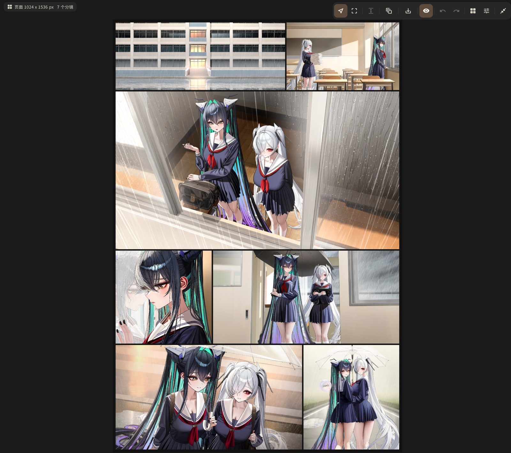
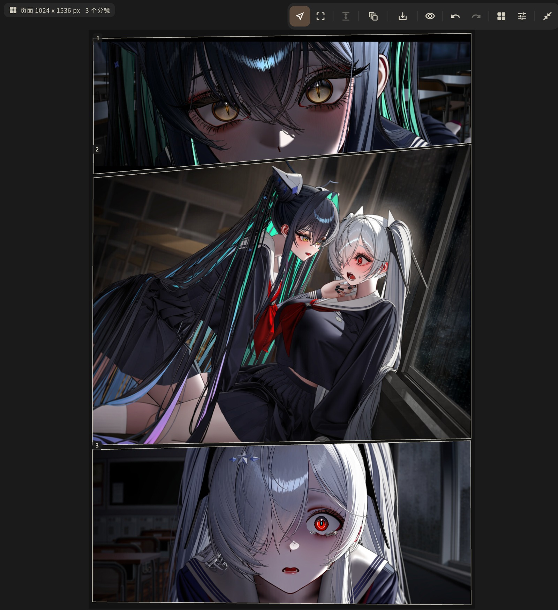

# NovelAI Launcher Neo

  <a href="README.md">简体中文</a> · 繁體中文 · <a href="README.en-US.md">English</a>

本倉庫是 [Aaalice233/Aaalice_NAI_Launcher](https://github.com/Aaalice233/Aaalice_NAI_Launcher) 的續更分支。

本倉庫僅供**自用維護**。

## 更新記錄

| 日期 | 版本 | 改動 | 圖示 |
| --- | --- | --- | --- |
| 2026-09-29 | 4.3.3 | 加入一個受控的分鏡編輯器：在生成頁中央工作區直接拉框排版分鏡，每格獨立設定提示詞、畫幅、角色與種子；支援受控的不規則分鏡——多邊形格子可逐點編輯、通欄混排等不規則版式一鍵生成，配逐格批次生成與整頁合成匯出；生成共用固定詞、Vibe 與免費檔鉗制等既有鏈路，AI 也可讀寫分鏡。 |   |
| 2026-09-13 | 4.3.2 | 生成頁中央區新增「無限畫布」：圖片、種子待辦與 Markdown 便籤節點可拖曳縮放、連線標註，畫布可依專案新建與切換，新生成的結果可自動落到畫布；修正畫廊 AI TAG 來源無法載入。 |  |
| 2026-09-12 | 4.3.1 | 參數面板模型選擇區新增「模式」（動漫／獸人），新增 NovelAI 圖片生成風格預設，主題切換改為從點擊位置展開圓形遮罩揭示；修正風格選擇彈窗無法開啟、DeepSeek V4.1 Flash 思考強度選項消失。 |  |
| 2026-09-12 | 4.3.0 | 更名 NovelAI-Launcher-Neo 並自上游獨立維護：Android 簽章憑證與 Windows 安裝位置變更，自動更新改指本倉庫，Google Drive 與 OneDrive 雲端硬碟備份下線。 |  |
